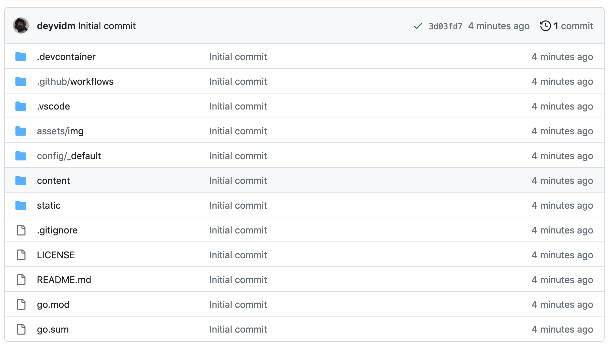
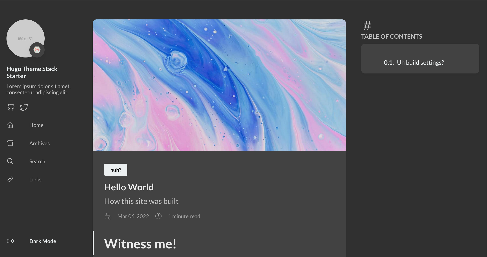

# Witness me! 

This is what our project looks like initially. 
It's a pretty good template! 
This runs locally just fine, so let's see how Amplify will handle it.

### Going to AWS

### Uh build settings? 

After making a new app and pointing a 
