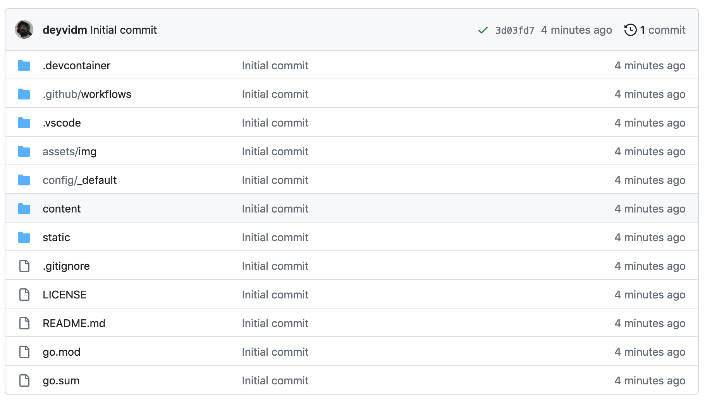
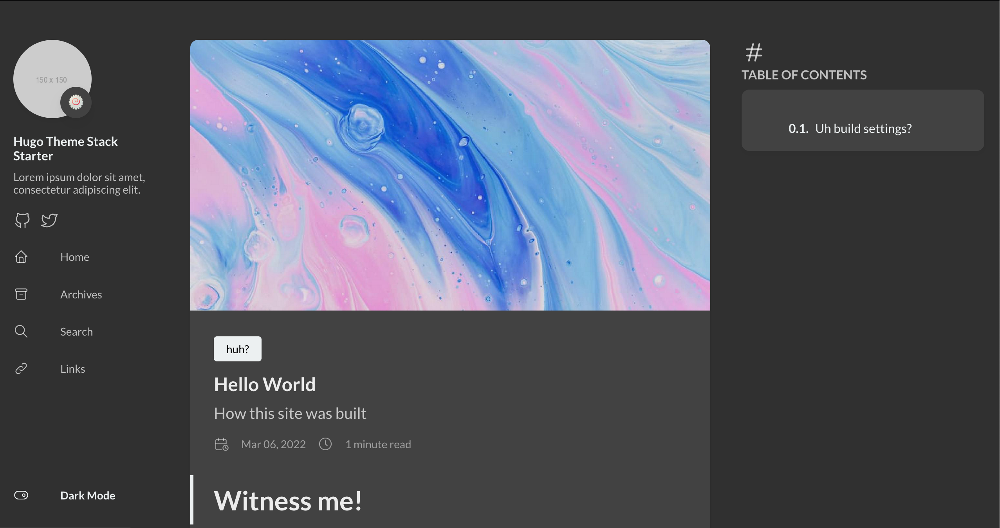
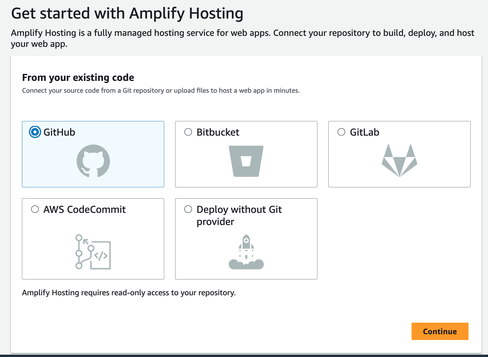
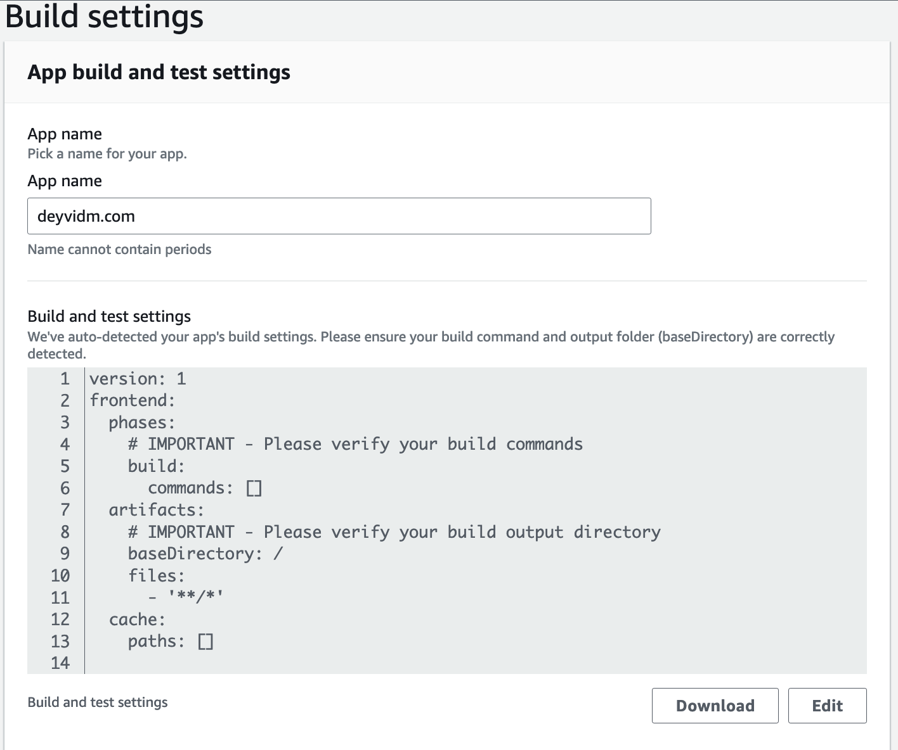
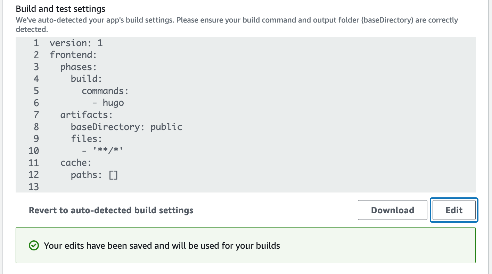
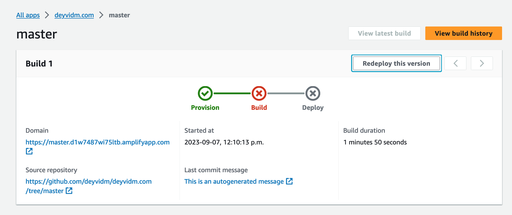
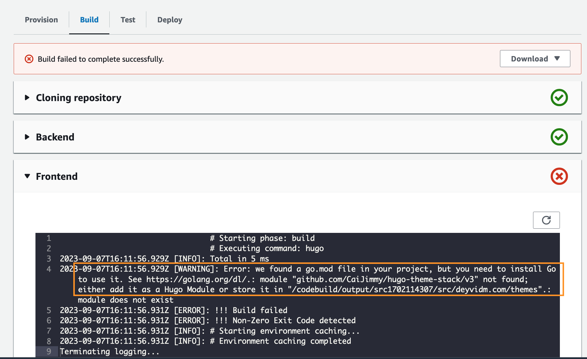

# Witness me! 



This is what our project looks like initially. 
It's a pretty good template! 
This runs locally just fine, so let's see how Amplify will handle it.

## Going to AWS

### New App
We auth with GitHub, we choose our repo from the dropdown, specify the (master) branch and...





Amplify gives us totally blank build settings! This is suboptimal.

### Build Settings

Let us refer to the [scriptures of Hugo](https://gohugo.io/documentation/) which pertain to [Deploying to Amplify](https://gohugo.io/hosting-and-deployment/hosting-on-aws-amplify/) and observe this third and most dubious instruction: 


Notice the difference in the build settings. Most notable you ought notice: 
```
build 
    commands: 
        - hugo 
```
and
```
baseDirectory: public 
``` 
We flip back over to Amplify and adjust our settings accordingly: 




## The Build 

### Build Dashboard 

In style with the rest of AWS, Amplify give us a cool dashboard to manage and monitor our builds. As we ought to have expected, the screen shall inform us that our build biffed it. 





